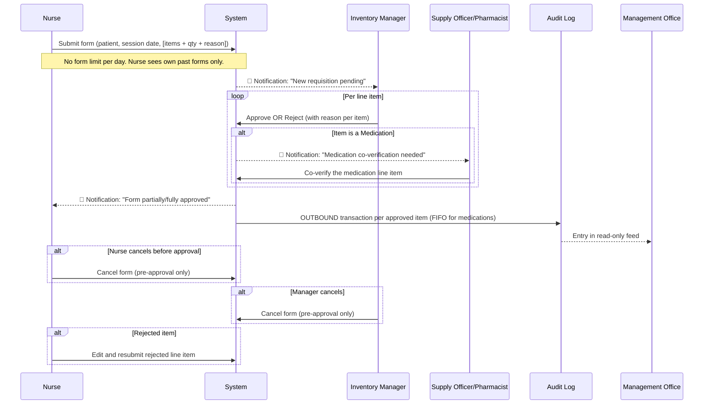

# Implementation Plan: Healing Hands Center / MedOPS Inventory System
**Version 2 — Updated June 30, 2026**

## Overview

A **web-based, dual-dashboard inventory management system** for a dialysis clinic. The **Clinic Dashboard** is branded as *Healing Hands Center* for clinical operations staff. The **Management Office Dashboard** is branded as *MedOPS* for administrative oversight. Both dashboards are served from a single application and rendered based on the logged-in user's role.

The system handles: dynamic role-based access control, nurse item acquisition with per-line-item approval, medications with strict expiry/batch/FIFO controls, patient-linked requests, supplier directory, item categories, monthly automated reporting, customizable dashboards, and a bulk import tool for paper record migration.

---

## Finalized Requirements Summary

| Topic | Decision |
| :--- | :--- |
| **Branding** | Clinic → *Healing Hands Center*, Management → *MedOPS* |
| **Management access** | View all logs + leave comments/flags only |
| **Purchase Orders** | No PO feature — clinic orders externally; system only tracks arrivals |
| **Hosting** | Local server for MVP/testing; cloud deployment for production |
| **Users** | 25–50 total accounts across all roles |
| **Locations** | Single clinic now; architecture supports multiple locations later |
| **Language** | English only |
| **UI Style** | Clean & functional (MVP first) |
| **Hardware** | No barcode scanner in MVP; deferred to later version |
| **Data migration** | Paper records → encoded via bulk CSV import tool |
| **Authentication** | Username + password with configurable inactivity timeout (set by Top Admin) |
| **Cost/Valuation** | Not tracked — quantities only |
| **Supplier tracking** | Full supplier directory with contact details |
| **Item organisation** | Categories + subcategories; managed by Top Admin and Inventory Manager |

---

## Role-Based Access Control (RBAC) — Dynamic System

> [!IMPORTANT]
> The RBAC system is **dynamic**. The Top Admin has a Permission Management panel where they can toggle specific permissions per role (applies to all users in that role) and also set per-user overrides for individual staff members. Every permission change is logged in the audit trail.

### Locked Permissions (Top Admin Only — Cannot Be Delegated)

These 4 permissions are permanently restricted to the Top Admin and cannot be changed by anyone:

| Locked Permission |
| :--- |
| Create / assign user roles |
| Configure session timeout |
| Configure monthly report schedule |
| Bulk CSV import (initial setup) |

### Default Permission Matrix (Adjustable by Top Admin)

| Permission | Top Admin | Inv. Manager | Nurse / Staff | Supply Officer | Viewer / Auditor | Mgmt Office |
| :--- | :---: | :---: | :---: | :---: | :---: | :---: |
| Add/edit/archive inventory items | ✅ | ✅ | ❌ | ❌ | ❌ | ❌ |
| Manage categories & subcategories | ✅ | ✅ | ❌ | ❌ | ❌ | ❌ |
| Manage supplier directory | ✅ | ✅ | ❌ | ❌ | ❌ | ❌ |
| Receive deliveries (stock-in) | ✅ | ✅ | ❌ | ✅ | ❌ | ❌ |
| Submit item acquisition form | ✅ | ✅ | ✅ | ✅ | ❌ | ❌ |
| Cancel own acquisition form | ✅ | ✅ | ✅ | ✅ | ❌ | ❌ |
| Cancel any acquisition form | ✅ | ✅ | ❌ | ❌ | ❌ | ❌ |
| Approve/reject requisition line items | ✅ | ✅ | ❌ | ❌ | ❌ | ❌ |
| Log discard/waste entry | ✅ | ✅ | ❌ | ✅ | ❌ | ❌ |
| Initiate stocktake | ✅ | ✅ | ❌ | ❌ | ❌ | ❌ |
| View inventory logs | ✅ | ✅ | Own forms only | ✅ | ✅ | ✅ (read-only) |
| Comment / flag on log entries | ❌ | ❌ | ❌ | ❌ | ❌ | ✅ |
| Manage patient list | ✅ | ✅ | ❌ | ❌ | ❌ | ❌ |
| Generate / export PDF reports | ✅ | ✅ | ❌ | ❌ | ✅ | ✅ |
| Trigger manual monthly report | ✅ | ❌ | ❌ | ❌ | ❌ | ❌ |
| Reset user passwords (temp password) | ✅ | ❌ | ❌ | ❌ | ❌ | ❌ |
| Delete user accounts | ✅ | ❌ | ❌ | ❌ | ❌ | ❌ |

> [!NOTE]
> Deleted user accounts are **soft-deleted**: the account is removed from active users but all their historical transactions, requisitions, and log entries remain linked to their name for audit integrity.

---

## System Architecture

```
┌──────────────────────────────────────────────────────────────────┐
│               Single Web Application (React + Vite)              │
├───────────────────────────┬──────────────────────────────────────┤
│   HEALING HANDS CENTER    │          MedOPS                      │
│   (Clinic Dashboard)      │   (Management Office Dashboard)      │
│                           │                                      │
│  • Role-tailored home     │  • Read-only live log feed           │
│    dashboard (customizable│  • Comment / Flag on entries         │
│    widgets per user)      │  • Stock level overview              │
│  • Inventory management   │  • Warning + Critical alert feed     │
│  • Requisition approval   │  • Expiry alerts                     │
│  • Stock receiving        │  • Monthly report access & export    │
│  • Medication controls    │  • Customizable dashboard widgets    │
│  • Patient list           │                                      │
│  • Supplier directory     │                                      │
│  • Category management    │                                      │
│  • Stocktake              │                                      │
│  • Discard/waste logging  │                                      │
│  • Reports & exports      │                                      │
│  • Permission management  │                                      │
└───────────────────────────┴──────────────────────────────────────┘
                            │
               ┌────────────▼────────────┐
               │   REST API (Node.js +   │
               │         Express)        │
               └────────────┬────────────┘
                            │
               ┌────────────▼────────────┐
               │   PostgreSQL Database   │
               │  (Prisma ORM)           │
               └─────────────────────────┘
```

---

## Item Catalog Structure

### Categories & Subcategories
Managed by Top Admin and Inventory Manager. Examples:

```
Medications
  ├── Injectable
  ├── Oral
  └── Topical
Medical Consumables
  ├── Dialysis Supplies
  └── Wound Care
Medical Equipment
PPE
  ├── Gloves
  └── Masks
Office & Cleaning Supplies
```

### Item Type Tracking Fields

| Item Type | Special Fields |
| :--- | :--- |
| Medical Consumables | SKU, Unit, Quantity, Warning Level, Critical Level |
| **Medications** | Batch/Lot No., Expiry Date, Supplier, FIFO-enforced, Warning Level, Critical Level |
| Medical Equipment | Serial Number, Acquisition Date, Condition |
| PPE | SKU, Unit, Quantity, Warning Level, Critical Level |
| Office / Cleaning Supplies | SKU, Unit, Quantity, Warning Level, Critical Level |

### Inventory Filtering (Available on all list views)
- Category
- Subcategory
- Item name / SKU (text search)
- Stock status: **In Stock** / **Low (Warning)** / **Critical** / **Out of Stock**

---

## Stock Alert System — Two Levels

| Level | Threshold | Visual Indicator | Notified Roles |
| :--- | :--- | :--- | :--- |
| ⚠️ Warning | Stock ≤ Warning threshold | Yellow | Inventory Manager, Top Admin |
| 🔴 Critical | Stock ≤ Critical threshold | Red (urgent) | Inventory Manager, Top Admin |
| Management visibility | Both levels | Visible on MedOPS dashboard | Management Office |

---

## Patient List Fields

| Field | Notes |
| :--- | :--- |
| Patient Name | |
| Patient ID / Chart Number | Unique identifier |
| Diagnosis | e.g., End-Stage Renal Disease |
| Dialysis Schedule | Days and times |
| Date of First Session | |
| Contact / Emergency Contact | Phone number |
| Status | Active / Inactive (archived when discharged) |

---

## Supplier Directory

Each supplier record contains:
- Supplier Name
- Contact Person
- Phone Number
- Email Address
- Address
- Items supplied (linked to item catalog)
- Notes / remarks

---

## Core Workflows

### Workflow 1 — Nurse Item Acquisition



### Workflow 2 — Stock Receiving

```
Supply Officer / Inv. Manager logs delivery
→ Selects supplier from directory
→ Enters item, quantity
→ For medications: enters batch/lot number + expiry date
→ System updates stock level + creates new batch record
→ INBOUND audit log entry created
→ Management Office feed updated
```

### Workflow 3 — Discard / Waste Entry

```
Authorized user logs discard
→ Selects item + reason (Expired / Damaged / Recalled / Other)
→ For medications: selects specific batch being discarded
→ Enters quantity discarded
→ Stock decremented, DISCARD audit log entry created
→ Appears in monthly report under "Discarded/Expired Items"
```

### Workflow 4 — Low-Stock & Expiry Alerts

| Event | Alert Level | Notified |
| :--- | :--- | :--- |
| Stock ≤ Warning threshold | ⚠️ Warning | Inv. Manager, Top Admin |
| Stock ≤ Critical threshold | 🔴 Critical | Inv. Manager, Top Admin |
| Medication expiring in 90 days | ⚠️ Warning | Inv. Manager, Top Admin |
| Medication expiring in 60 days | ⚠️ Warning | Inv. Manager, Top Admin |
| Medication expiring in 30 days | 🔴 Urgent | Inv. Manager, Top Admin |

### Workflow 5 — Monthly Report

```
Auto-generated on configured date (Top Admin sets schedule)
OR manually triggered by Top Admin anytime
→ Compiles all activity since last monthly report
→ PDF sections:
   1. Current stock snapshot per item
   2. All transactions (IN / OUT / DISCARD / ADJUST) for the period
   3. Requisition summary (total, approved, rejected)
   4. Per-nurse usage breakdown
   5. Per-patient consumption summary
   6. Low-stock and out-of-stock items
   7. Medications expiring within next 90 days
   8. Discarded/expired items removed during the period
→ 🔔 Notification sent to Top Admin when generated
→ Downloadable by: Top Admin, Inv. Manager, Viewer/Auditor, Management Office
```

### Workflow 6 — Stocktake / Physical Count

```
Initiated by Inv. Manager or Top Admin
→ 🔔 Notification sent to all clinic staff: "Stocktake in progress"
→ System generates stock count sheet (current system quantities)
→ Staff physically counts and enters actual quantities
→ System highlights discrepancies
→ Inv. Manager / Top Admin reviews and approves adjustments
→ ADJUSTMENT entries logged in audit trail
```

### Workflow 7 — Permission Management

```
Top Admin opens Permission Management panel
→ Selects a Role (e.g., "Nurse") OR an Individual User
→ Toggles specific permissions ON or OFF
   (Locked permissions are greyed out and cannot be changed)
→ Saves changes
→ PERMISSION CHANGE logged: who changed what, when, for which role/user
→ Affected users see updated permissions on next action attempt
```

---

## Notification System

All notifications use a **bell icon with dropdown** in the top navigation bar. Unread notifications must be **explicitly marked as read**.

| Event | Recipients |
| :--- | :--- |
| Requisition submitted | Inventory Manager |
| Requisition approved / rejected | Requesting nurse |
| Low-stock warning reached | Inventory Manager, Top Admin |
| Low-stock critical reached | Inventory Manager, Top Admin |
| Expiry alert (90/60/30 days) | Inventory Manager, Top Admin |
| Management Office comment/flag | Top Admin, Inventory Manager |
| Stocktake initiated | All clinic staff |
| Monthly report generated | Top Admin |
| User account created or role changed | Top Admin |

---

## Dashboard — Role-Tailored Home Screens

After login, each user lands on a **personalized home dashboard** with widgets relevant to their role. Users can **customize which widgets appear** on their home screen.

| Role | Default Home Widgets |
| :--- | :--- |
| Top Admin | Pending requisitions · Low/Critical stock count · Expiry alerts · Recent permission changes · Monthly report status |
| Inventory Manager | Pending approval queue · Low/Critical stock alerts · Expiry alerts · Recent transactions · Discard log |
| Nurse / Staff | My submitted forms (status) · Recent notifications |
| Supply Officer | Pending deliveries to log · Low/Critical stock · Discard log |
| Viewer / Auditor | Inventory summary · Recent transaction log · Expiry summary |
| Management Office (MedOPS) | Live transaction feed · Stock overview · Warning/Critical alerts · Monthly report download |

---

## Tech Stack

| Layer | Technology |
| :--- | :--- |
| Frontend | React + Vite |
| Styling | Vanilla CSS (clean MVP aesthetic) |
| Backend API | Node.js + Express |
| Database | PostgreSQL |
| ORM | Prisma |
| Auth | JWT + HTTP-only cookies + configurable session timeout |
| PDF Generation | Puppeteer (server-side, full report rendering) |
| CSV Bulk Import | Multer + Papa Parse |
| Local Dev | `npm run dev` (Vite) + Node server |
| Cloud Deploy (later) | TBD (e.g., Railway, Render, or VPS) |

---

## Database Schema (Core Tables)

```
-- Auth & Users
users                → id, name, username, password_hash, role, is_active, is_deleted, deleted_at, created_by
session_config       → timeout_minutes

-- RBAC
role_permissions     → role, permission_key, is_enabled
user_permissions     → user_id, permission_key, is_enabled (overrides role default)
permission_audit_log → id, changed_by, target_type (role/user), target_id, permission_key, old_value, new_value, changed_at

-- Suppliers
suppliers            → id, name, contact_person, phone, email, address, notes

-- Item Catalog
categories           → id, name, parent_id (for subcategories)
items                → id, name, sku, category_id, unit, warning_level, critical_level, supplier_id, is_archived
item_batches         → id, item_id, batch_no, expiry_date, quantity_remaining, received_at
stock_levels         → item_id, quantity_on_hand, last_updated

-- Patients
patients             → id, name, chart_number, diagnosis, schedule, first_session_date, contact, status

-- Requisitions
requisitions         → id, patient_id, submitted_by, session_date, status, created_at
requisition_lines    → id, requisition_id, item_id, qty_requested, qty_approved, reason, status,
                       reviewed_by, rejection_reason, is_resubmission, original_line_id

-- Transactions & Logs
transaction_logs     → id, item_id, batch_id, type (IN/OUT/DISCARD/ADJUST/CANCEL),
                       qty, user_id, requisition_line_id, timestamp, notes
discard_logs         → id, item_id, batch_id, qty, reason, logged_by, timestamp
mgmt_comments        → id, transaction_log_id, comment_text, is_flagged, commented_by, created_at

-- Stocktake
stocktakes           → id, initiated_by, initiated_at, status, completed_at
stocktake_lines      → id, stocktake_id, item_id, system_qty, physical_qty, discrepancy, approved_by

-- Reports
monthly_reports      → id, period_start, period_end, generated_by, generated_at, pdf_path
report_schedule      → day_of_month, is_active

-- Import
import_logs          → id, file_name, imported_by, imported_at, rows_success, rows_failed

-- Notifications
notifications        → id, user_id, event_type, message, is_read, created_at

-- Dashboard
user_dashboard_prefs → user_id, widget_key, is_visible, display_order
```

---

## Development Phases (14-Week Roadmap)

### Phase 1 — Foundation (Weeks 1–2)
- [ ] Project scaffolding: Vite + Express + PostgreSQL + Prisma
- [ ] Authentication: login, JWT, session timeout (configurable by Top Admin)
- [ ] Dual-brand routing: Healing Hands Center vs. MedOPS layout based on role
- [ ] Dynamic RBAC engine: role-level permissions + per-user overrides + locked permissions
- [ ] Permission Management panel (Top Admin)
- [ ] Permission change audit logging

### Phase 2 — User & Account Management (Week 3)
- [ ] User management: Top Admin creates accounts, assigns roles, resets passwords (temp password)
- [ ] Account soft-delete: removes login access, preserves all historical data
- [ ] User dashboard customization (widget preferences per user)

### Phase 3 — Supplier Directory & Item Catalog (Week 4)
- [ ] Supplier CRUD (name, contact person, phone, email, address, notes)
- [ ] Category and subcategory management
- [ ] Item catalog CRUD (all item types with type-specific fields)
- [ ] Warning + Critical threshold configuration per item
- [ ] Inventory list with advanced filtering (category, subcategory, name/SKU, stock status)

### Phase 4 — Stock Management (Week 5)
- [ ] Stock receiving workflow (delivery-in with batch/expiry for medications, linked to supplier)
- [ ] Stock level tracking + FIFO batch ordering for medications
- [ ] Warning + Critical alert engine (triggered on every stock-out transaction)
- [ ] Expiry alert engine: 90/60/30 days before expiry

### Phase 5 — Patient List (Week 6)
- [ ] Patient CRUD (all 7 fields)
- [ ] Active/Inactive status toggle with archiving
- [ ] Patient search and filtering

### Phase 6 — Requisition System (Weeks 7–8)
- [ ] Nurse item acquisition form (per-patient, per-session, multi-item, no submission limit)
- [ ] Per-line-item approval queue for Inventory Manager
- [ ] Medication co-verification step (Supply Officer/Pharmacist)
- [ ] FIFO enforcement for medication dispensing from oldest batch
- [ ] Form cancellation by submitting nurse or Inventory Manager (pre-approval only)
- [ ] Resubmission flow for rejected line items (rejection reason visible to nurse)
- [ ] In-app notifications (bell + dropdown + mark-as-read)

### Phase 7 — Discard & Waste Logging (Week 9)
- [ ] Discard/waste entry (Expired / Damaged / Recalled / Other)
- [ ] Batch selection for medication discards
- [ ] Stock decrement + DISCARD transaction log entry

### Phase 8 — Management Office Dashboard (Week 10)
- [ ] MedOPS read-only audit log feed (real-time updates)
- [ ] Comment/flag feature for Management Office users
- [ ] Stock overview with Warning/Critical alert visibility
- [ ] Expiry alert visibility on MedOPS dashboard

### Phase 9 — Reports & Stocktake (Weeks 11–12)
- [ ] On-demand PDF export (filtered log views)
- [ ] Monthly report generator (all 8 sections, PDF via Puppeteer)
- [ ] Monthly report auto-schedule (day-of-month configurable by Top Admin)
- [ ] Manual monthly report trigger (Top Admin)
- [ ] Stocktake: initiation, count entry, discrepancy review, adjustment logging
- [ ] Stocktake notification to all clinic staff

### Phase 10 — Role-Tailored Dashboards (Week 13)
- [ ] Default home dashboard widgets per role
- [ ] Widget customization UI (show/hide, reorder)
- [ ] Notification bell with dropdown and mark-as-read

### Phase 11 — Data Import & Final Polish (Week 14)
- [ ] Bulk CSV import tool (Top Admin only): items, patients, suppliers, initial stock levels
- [ ] Import validation and error reporting (success/failure summary)
- [ ] Full UI review and refinement
- [ ] Security hardening: input sanitization, rate limiting, HTTPS
- [ ] End-to-end testing of all workflows

---

## Verification Plan

### Automated Tests
- RBAC: verify no role can perform actions outside their current permission matrix
- Dynamic permissions: changing a role permission immediately affects all users in that role
- Locked permissions: verify they cannot be toggled even via API
- Stock integrity: quantity never goes negative after any transaction
- FIFO: dispensed medication always deducts from the oldest valid batch first
- Expiry alerts: trigger at exactly 90, 60, and 30 days before expiry date
- Soft delete: deleted user's transactions still appear in audit logs under their name

### Manual / UAT Verification
- Top Admin toggles a permission for the Nurse role → verify all nurses gain/lose that action immediately, and the change appears in the permission audit log
- Nurse submits a multi-item form with a medication → manager approves 3/5 items → Supply Officer co-verifies the medication → nurse sees partial approval, resubmits rejected items
- Supply Officer receives a medication delivery with batch + expiry → system assigns FIFO order correctly on next dispensing
- Simulate Warning then Critical stock → verify correct alert level and color appears in both clinic and MedOPS dashboards
- Management Office user logs in, views logs, adds a comment/flag → clinic admin sees it in notifications
- Top Admin triggers a manual monthly report → verify all 8 sections are present and accurate in the PDF
- Top Admin soft-deletes a user → their past requisitions and transactions remain fully visible in logs
- Upload a CSV file with 50 items → verify import summary shows correct success/error counts
- Set inactivity timeout to 1 minute, verify auto-logout after 1 minute of inactivity

---

## Deferred to Later Version
- Barcode scanner / RFID integration
- Multi-location (multi-ward) inventory separation
- Cloud deployment configuration
- Doctor's prescription reference for medication requests
- Email/SMS notifications (currently in-app only)
- Mobile-responsive design optimization
