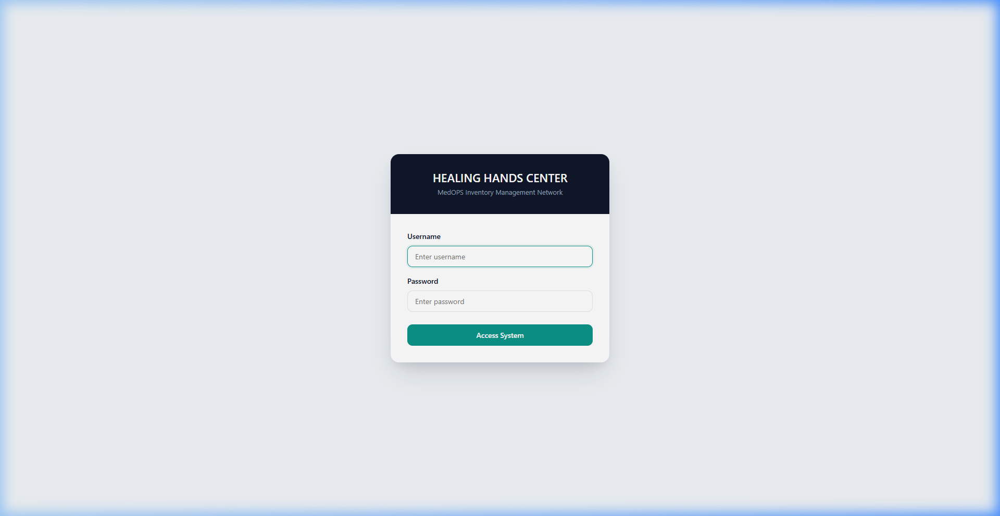
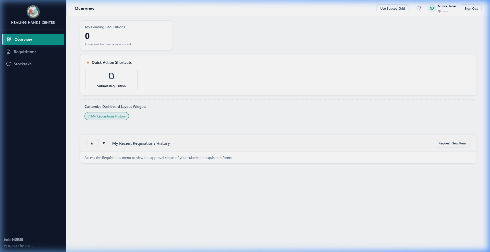
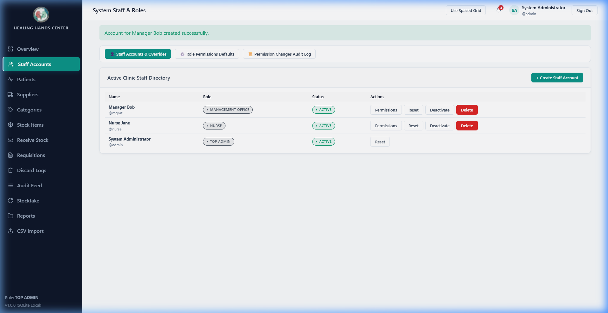
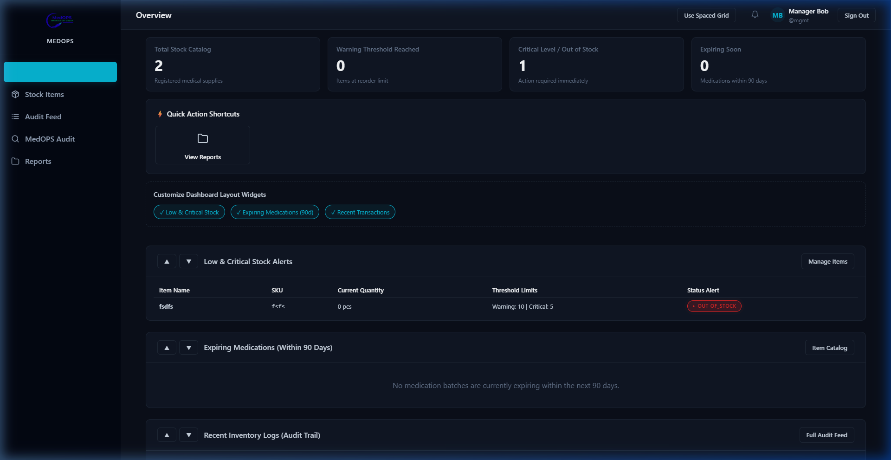

# Healing Hands Center & MedOPS
## Simplified User Manual
**A Friendly Guide to Your Inventory System**

Welcome to your new inventory system! This guide is written to help you understand how to navigate the system, request items, receive shipments, track waste, and manage system configurations. 

This system has a **dual-dashboard design** served from a single website:
1. **Healing Hands Center (Clinic Dashboard)**: Used by clinic staff (Nurses, Supply Officers, and Clinic Managers) for everyday work like requesting medical supplies, receiving shipments, and logging count sheets.
2. **MedOPS (Management Office Dashboard)**: Used by administrative auditors in the management office to view audit logs, leave comments, and download monthly operational summaries.

---

## 1. Getting Started: The Login Screen

Every user logs in through the same screen. The system automatically detects your role (e.g., Nurse, Top Admin) and shows you the correct dashboard.

### Quick Checklist:
1. **Username**: Type your assigned login name (e.g., `admin` or `nurse`).
2. **Password**: Type your password (remember: passwords are case-sensitive).
3. **Access System**: Click the primary button to enter the dashboard.
4. **Security Notice**: For security, if you leave your computer screen idle for too long, the system will log you out automatically. Simply log back in to resume your session.

---

## 2. Guide for Nurses & Clinical Staff

As a nurse, your primary job in the system is to request items needed for dialysis sessions and to help count stock during inventory reviews.

### 2.1 Your Dashboard
Once logged in, you will land on the **Nurse Home Page**. It is clean, focused, and highlights your recent activity.

* **Sidebar**: Links to your **Dashboard**, **Patient List**, **Requisitions** (request forms), and **Stocktake** sheets.
* **Notification Bell** (top right): Click this to see if a manager has approved your requests or if a new count is needed.
* **My Pending Requisitions Widget**: Shows a live status of your submitted requests (e.g., *Pending*, *Partially Approved*, or *Approved*).

---

### 2.2 Submitting an Item Request (Requisition)
When you need to take items out of stock for a patient's dialysis session:

1. Click **Requisitions** in the sidebar, then click **New Requisition**.
2. **Select the Patient**: Select the dialysis patient from the dropdown list.
3. **Session Date**: Input the date of the dialysis session.
4. **Add Items**:
   - Choose the item (e.g., Dialyzer, AV Fistula Needle, or Heparin).
   - Enter the **Requested Quantity**.
   - Type a brief reason (e.g., "Regular session supplies").
5. Click **Submit Requisition**.

### 2.3 Checking Request Status & Resubmitting
* **Tracking approvals**: Go to **Requisitions** to see your list of requests.
* **Rejections**: If a manager rejects a line item, they will write a reason (e.g., "Quantity too high"). You will get a notification.
* **How to fix it**: Click the rejected requisition, click **Edit and Resubmit**, adjust the quantities as suggested by the manager, and click submit again.
* **Cancellation**: If you made a mistake, you can cancel your request *only* if the manager has not approved or rejected it yet.

### 2.4 Participating in Stocktakes (Counts)
When the clinic managers start a physical inventory count:
1. Click **Stocktake** in the sidebar. The active count sheets will automatically load.
2. Go to the shelves, count the items physically present, and type the counts into the **Physical Quantity** box.
3. Click **Save Counts**. You can update these counts as you go.

---

## 3. Guide for Supply Officers & Pharmacists

As a Supply Officer or Pharmacist, you handle the arrival of deliveries, double-check medication requests, and log wasted inventory.

### 3.1 Logging Shipments (Stock-In)
When a delivery arrives from a supplier:
1. Click **Receive Stock** in the sidebar.
2. Select the **Supplier** from the dropdown.
3. Add the items that arrived:
   - Select the item.
   - Enter the **Quantity Received**.
   - **For Medications**: You **MUST** enter the **Batch / Lot Number** and the **Expiry Date** printed on the packaging.
     > [!WARNING]
     > The system will block you from receiving a medication batch that has already expired.
4. Click **Log Stock Inbound** to update global stock levels.

### 3.2 Medication Co-Verification
For clinical safety, medications requested by nurses need a second co-verification before they are given out:
1. When a nurse requests a medication and a manager approves it, you will see it in your co-verification queue.
2. Click **Co-Verify** next to the medication item.
3. The system will automatically allocate the oldest available medication batch (using a strict **First-In, First-Out (FIFO)** sequence) to ensure items are used before they expire.

### 3.3 Logging Waste & Discards
If an item is damaged, goes out-of-date, or is recalled:
1. Click **Discards** in the sidebar, and click **Log Discard/Waste**.
2. Select the item and input the quantity to remove from stock.
3. Select the **Reason** (*Expired*, *Damaged*, *Recalled*, or *Other*).
4. **For Medications**: Select the specific **Batch / Lot Number** from the dropdown that you are throwing away.
5. Click **Log Discard**.

---

## 4. Guide for Inventory Managers

Inventory Managers oversee stock levels, review requisitions, and organize inventory counts.

### 4.1 Approving & Rejecting Requests
1. Navigate to **Requisitions** > **Pending Queue**.
2. You will see a list of requests submitted by nurses.
3. **Per-Item Review**: For each item in the request, click **Approve** or **Reject**.
   - If you click **Reject**, you must type a reason so the nurse knows how to correct it.
4. Once co-verified (for medications) or approved (for consumables), the system automatically decrements stock.

### 4.2 Stock alerts & thresholds
Go to **Items** in the sidebar. For any item, click edit to configure:
* ⚠️ **Warning threshold**: When stock drops to or below this count, it highlights in yellow.
* 🔴 **Critical threshold**: When stock drops to or below this count, it highlights in red.

### 4.3 Running a Stocktake
1. When it is time for a physical audit, navigate to **Stocktake** and click **Initiate Stocktake**.
2. Instruct clinical staff to enter counts on their terminals.
3. Review the completed count sheet. The system will show **Discrepancies** in red or yellow.
4. Click **Complete and Reconcile Stocktake** to automatically update the system stock to match physical counts.

---

## 5. Guide for Top Administrators

As a Top Admin, you hold locked permissions that cannot be delegated to anyone else. You control users, configuration settings, and permissions.

### 5.1 User Management & Password Resets
Under the **Staff Accounts** sidebar link, you manage who can access the system.

* **Create Account**: Click **Create Staff Account** to register a new user, specify their name, username, password, and role.
* **Temporary Passwords**: If a user forgets their password, click **Reset Password** next to their name to generate a temporary login key.
* **Deleting Accounts**: Click the delete icon. Deleted accounts are "soft-deleted": their access is revoked immediately, but their name remains attached to their past transactions for audit integrity.

---

### 5.2 Managing Permissions & Custom Roles
You can customize exactly what each user role is allowed to do.

1. Navigate to **User Management** > **Roles & Permissions**.
2. To edit a role (e.g., *Nurse*), toggle the checkmarks for specific permissions on or off.
3. **Individual User Overrides**: If a specific nurse needs special privileges, click **Manage User Overrides** on their profile page to assign special permissions just for them.
   > [!IMPORTANT]
   > Certain permissions (like creating users, changing timeouts, and bulk CSV imports) are **Locked Permissions** and can only be performed by the Top Admin.

---

### 5.3 Configuring Sessions & Schedules
* **Session Inactivity Time**: Set the number of minutes of keyboard/mouse inactivity before the system automatically signs users out.
* **Report Schedules**: Set the day of the month (e.g., the 1st) for automated monthly summaries.

### 5.4 Bulk CSV Import
When migrating from old paper records:
1. Go to the **Import** tab.
2. Select your category (Suppliers, Patients, Items, or Medication Batches).
3. Download the sample template.
4. Upload your populated CSV file. The system will report how many rows imported successfully.

---

## 6. Guide for the Management Office & Auditors (MedOPS)

As an auditor or director in the management office, you monitor the clinic remotely using the **MedOPS Dashboard**.

### 6.1 The MedOPS Home Dashboard
Your view of the system is customized for high-level monitoring and auditing.

* **Read-Only**: You can see all item categories, stock levels, and transaction logs, but you cannot add or remove stock.
* **Live Audit Feed**: Monitor all transactions (`IN`, `OUT`, `DISCARD`, `ADJUST`) in real-time.
* **Low Stock / Expiry Alerts**: Watch for yellow and red alerts representing items that need refilling or are close to expiring.

---

### 6.2 Leaving Comments & Flags
If you notice something unusual in the live feed (e.g., a large discard log):
1. Click the transaction row in the **Audit Feed**.
2. Click **Add Comment / Flag**.
3. Type your note and check **Flag as Urgent** if it requires attention.
4. Saving this will instantly send a notification alert to the clinic's Top Admin and Inventory Managers.

---

### 6.3 Monthly Reports & Logs Export
* **On-Demand Exports**: Go to **Transaction Logs**, apply filters (by date, transaction type, or item), and click **Export CSV** or **Export PDF**.
* **Monthly Summaries**: Go to the **Reports** tab to download compiled monthly report files. They contain current stock snapshots, monthly transactions, nurse consumption metrics, low stock warnings, expiring medications, and discard logs.
